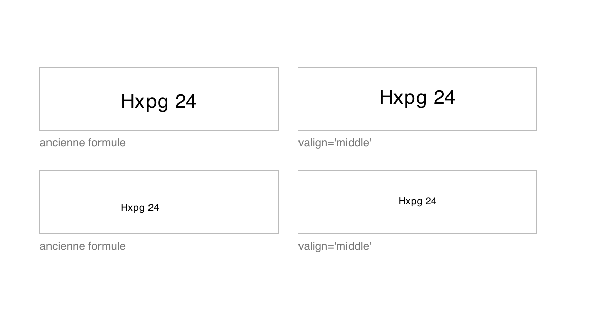

# reportlab_layout

[](https://pypi.org/project/reportlab_layout/)
[](https://pypi.org/project/reportlab_layout/)
[](LICENSE)

Un curseur qui descend dans la page, et le canvas reportlab resté sous la main.

```bash
pip install reportlab_layout
```

```python
from reportlab_layout import PDFMaker

with PDFMaker("bulletin.pdf", top=25, auto_page_break=True) as doc:
    doc.set_footer(doc.make_paragraph("Établissement X", "Right"))
    doc.draw_paragraph("Bulletin du 3e trimestre", "Heading1 Centered")
    doc.draw_centered_line(wscale=0.4)
    doc.add_space()
    doc.draw_table([["Matière", "Note"], ["Mathématiques", "17"]])

    # Et au même endroit, sans changer d'outil ni de fichier :
    doc.draw_round_rect(doc.x_left, doc.cursor_y - 40, doc.content_width, 40, radius=6, fill="#eef4fb")
    doc.draw_string("Mention", *doc.cursor_point, halign="left", valign="middle")
```

## Le problème que ça règle

reportlab offre deux façons de faire, et elles ne se mélangent pas bien.

Le **canvas** dessine où vous lui dites, en points, depuis le coin bas-gauche.
Précis, mais vous tenez vous-même la position courante, vous recalculez les
hauteurs à la main, et une ligne insérée au milieu décale tout le reste.

**Platypus** enchaîne des *flowables* dans des frames et gère le flux, la
pagination, la coupure des tableaux. Mais il prend la main sur la page : pour
tracer un cadre au point près derrière un paragraphe, il faut passer par les
rappels `onPage` d'un `BaseDocTemplate`, c'est-à-dire écrire la mise en page à
deux endroits différents et dans le désordre.

Ce paquet garde les flowables de platypus, mais les pose lui-même à la position
d'un curseur que vous pouvez lire, déplacer et interroger à tout moment. Le
canvas reste accessible par `doc.canvas`. Les deux modes se mélangent ligne à
ligne.

```python
doc.draw_paragraph("Ce paragraphe descend le curseur.")   # flux
y = doc.cursor_y                                          # position courante
doc.draw_rect(doc.x_left, y - 30, doc.content_width, 30)  # absolu
doc.advance(30)                                           # le curseur suit
```

## Ce qu'il apporte

- **Un curseur explicite.** `doc.cursor.depth`, `doc.cursor_y`,
  `doc.remaining_height`, `doc.advance(h)`. Aucune magie : vous savez toujours
  où vous en êtes dans la page.
- **Une seule méthode pour le texte simple.** `draw_string(texte, x, y,
  halign=…, valign=…, scale=…, angle=…)` remplace la demi-douzaine de variantes
  qu'on finit toujours par écrire, et **le centrage vertical est juste** — voir
  plus bas.
- **Un retour uniforme.** Chaque tracé rend une `Box(x, y, width, height)`, qui
  se déballe comme un quadruplet. On sait ce qu'on vient de poser et où.
- **Les deux repères tenus séparément.** L'ordonnée canvas monte, la profondeur
  du curseur descend ; `PageGeometry` est le seul endroit qui convertit.
- **Rien qui fuit.** Chaque tracé est encadré par `saveState`/`restoreState` :
  une couleur ou une épaisseur de trait ne contamine pas le tracé suivant.
- **Deux dépendances**, reportlab et Pillow. Ni navigateur sans tête, ni LaTeX,
  ni binaire système.

## Le centrage vertical, puisque c'est le point de départ

`canvas.drawString(x, y, texte)` place la **ligne de base** en `y`. Pour centrer
une chaîne dans une case, la formule qu'on écrit spontanément est
`y_centre - hauteur/2` avec `hauteur = ascendante - descendante`. Elle est
fausse : la descendante étant négative, elle descend le texte de `|descendante|`
de trop, soit environ 20 % du corps. Le bon décalage est
`y_centre - (ascendante + descendante)/2`.



Le filet rouge marque le milieu exact de la case. À gauche l'ancienne formule, à
droite `valign="middle"`. En bas la même chose au corps réduit de moitié : la
version fautive dérive aussi horizontalement, parce que la largeur était mesurée
au corps nominal alors que le texte était tracé plus petit.

```python
doc.draw_string("Titre", x, y, halign="center", valign="middle", scale=0.5)
```

`TextMetrics` porte la correction : toutes ses métriques tiennent compte de
l'échelle, et `baseline(y, valign)` rend directement la ligne de base voulue.

Reste une question que la formule ne tranche pas : centrer **quoi** ?
`valign="middle"` centre la boîte em, qui réserve la place des jambages même
quand la chaîne n'en a pas — un libellé comme `DS 3` s'en trouve haut d'environ
10 % du corps. `valign="cap"` centre la boîte de capitale : sur une étiquette
courte, l'encre tombe au milieu de sa case à moins d'un vingtième de point, et
une rangée d'étiquettes partage la même ligne de base qu'elles aient ou non des
jambages. C'est l'ancrage des cellules, bandeaux et badges. Le détail chiffré
est dans [`docs/DOC.md`](docs/DOC.md#middle-ou-cap-).

## Étude comparative

### Le paysage

| Outil | Modèle | Dép. système | Licence | Statut (août 2026) |
| --- | --- | --- | --- | --- |
| [reportlab](https://pypi.org/project/reportlab/) canvas | absolu, points | non | BSD | 5.0.1, très actif |
| reportlab platypus | flux, flowables | non | BSD | idem |
| **`reportlab_layout`** | **curseur + canvas** | **non** | **MIT** | **ce paquet** |
| [fpdf2](https://pypi.org/project/fpdf2/) | curseur natif | non | LGPL-3.0 | 2.8.8, très actif |
| [pdfino](https://pypi.org/project/pdfino/) | surcouche platypus | non | MIT | 0.1.0, 2023 |
| [pdfdocument](https://pypi.org/project/pdfdocument/) | surcouche platypus | non | BSD | 4.0.0, 2020 |
| [borb](https://pypi.org/project/borb/) | modèle objet | non | AGPL-3.0 | 3.0.9, actif |
| [WeasyPrint](https://pypi.org/project/weasyprint/) | HTML + CSS | non | BSD | 69.0, très actif |
| [pdfme](https://pypi.org/project/pdfme/) | document décrit en dict | non | MIT | 0.5.0 |
| [rst2pdf](https://pypi.org/project/rst2pdf/) | reStructuredText | non | MIT | 0.105, actif |
| pypdf / pikepdf | manipulation, pas génération | non | BSD / MPL | actifs |
| pylatex, Typst, wkhtmltopdf | balisage + moteur externe | **oui** | diverses | variés |

### Ce que fait vraiment la concurrence

**reportlab platypus** est le concurrent sérieux, et il fait beaucoup plus que
ce paquet : coupure de tableaux sur plusieurs pages, `KeepTogether`, table des
matières, signets, gabarits multi-frames. Si votre document est un rapport qui
coule tout seul du début à la fin, **utilisez platypus** : ce paquet n'a rien à
lui apporter. La différence tient à un point : dès qu'il faut alterner tracé
libre et flux dans le même geste, platypus vous impose de séparer le contenu
(la *story*) de la décoration (les rappels `onPage`). Ici, tout s'écrit dans
l'ordre où ça se dessine.

**fpdf2** est la comparaison la plus honnête, parce que c'est déjà un modèle à
curseur — `set_xy`, `cell`, `multi_cell`, `ln()` — et qu'il est excellent :
sous-ensemble HTML, tableaux, signature numérique, communauté vivante. Trois
différences concrètes. Sa licence est la LGPL-3.0, ce qui suffit à l'écarter
dans certains contextes ; reportlab est BSD et ce paquet MIT. Son moteur de
texte riche est un sous-ensemble HTML là où les `Paragraph` de reportlab
acceptent un balisage propre (`<super>`, `<font>`, indices, puces) et savent se
replier dans une largeur donnée. Et son curseur *est* l'API : on ne peut pas
poser un flowable reportlab au milieu. Si vous partez de zéro et que la LGPL ne
vous gêne pas, fpdf2 est un très bon choix.

**pdfino** et **pdfdocument** occupent exactement la même case : une surcouche
séquentielle au-dessus de platypus. Elles sont plus anciennes et plus simples —
`h1()`, `p()`, `table()` — et pdfino permet même d'insérer un flowable brut.
Ce qu'aucune des deux n'offre : la lecture et le déplacement explicites du
curseur, le placement absolu en points dans la même API, les métriques de
police corrigées, et une `Box` en retour de chaque tracé. Elles publient un
document ; celui-ci laisse construire une page. À noter aussi : pdfdocument n'a
pas publié depuis 2020 et pdfino en est à une 0.1.0 de 2023.

**borb** propose un modèle objet complet et lit aussi les PDF existants. C'est
plus ambitieux ; c'est aussi de l'AGPL-3.0, une licence qui contamine tout
service qui l'expose sur le réseau. À écarter d'emblée en contexte propriétaire.

**WeasyPrint** produit la plus belle typographie de la liste et gère le CSS
paginé (`@page`, en-têtes courants, coupures). Le prix à payer : il faut
exprimer la mise en page en HTML et CSS, et le rendu passe par un moteur de
rendu complet. Pour un document dont la géométrie se calcule — un planning
annuel, un tableau de créneaux, une grille de photos — décrire des coordonnées
en CSS est un détour. Pour une facture ou un rapport dont vous avez déjà le
gabarit web, WeasyPrint gagne largement.

**pdfme**, **rst2pdf**, **pylatex** partagent le même parti : décrire le
document dans un format (dict, reStructuredText, LaTeX) et laisser un moteur le
composer. Excellent quand le contenu est le sujet ; inadapté quand ce sont les
coordonnées qui le sont. pylatex et Typst ajoutent en plus une dépendance
système lourde.

**pypdf** et **pikepdf** ne génèrent pas de document : ils fusionnent, découpent
et signent. Complémentaires, pas concurrents.

### En résumé

| Votre besoin | Préférez |
| --- | --- |
| Un rapport qui coule tout seul, tableaux coupés sur plusieurs pages, table des matières | reportlab platypus |
| Le gabarit existe déjà en HTML/CSS | WeasyPrint |
| Un curseur simple, sans reportlab, et la LGPL ne pose pas problème | fpdf2 |
| Publier un document simple en quelques appels | pdfino |
| Découper, fusionner ou signer des PDF existants | pypdf, pikepdf |
| Le contenu est un texte balisé | rst2pdf, pylatex |
| **Une page dont la géométrie se calcule, en alternant flux et tracé au point près** | **`reportlab_layout`** |

Ce paquet occupe une case étroite : les documents où l'on connaît la formule qui
donne la position de chaque élément — plannings, grilles, calendriers, tableaux
de créneaux, planches — et où l'on veut quand même écrire du texte au fil de
l'eau sans compter les points à la main.

## Aller plus loin

- [`docs/DOC.md`](docs/DOC.md) — référence complète de l'API, repères,
  positionnement, styles, métriques, frames, pagination.
- [`examples/attestation.py`](examples/attestation.py) — un document d'une page,
  flux et tracé absolu mêlés.
- [`scripts/centering_proof.py`](scripts/centering_proof.py) — la preuve
  chiffrée et visuelle du centrage.

## Compatibilité

Python 3.11 à 3.14, reportlab 4.x et 5.x. La matrice d'intégration continue
couvre chacune de ces huit combinaisons.

## Licence

MIT. reportlab est sous licence BSD, Pillow sous licence MIT-CMU.
