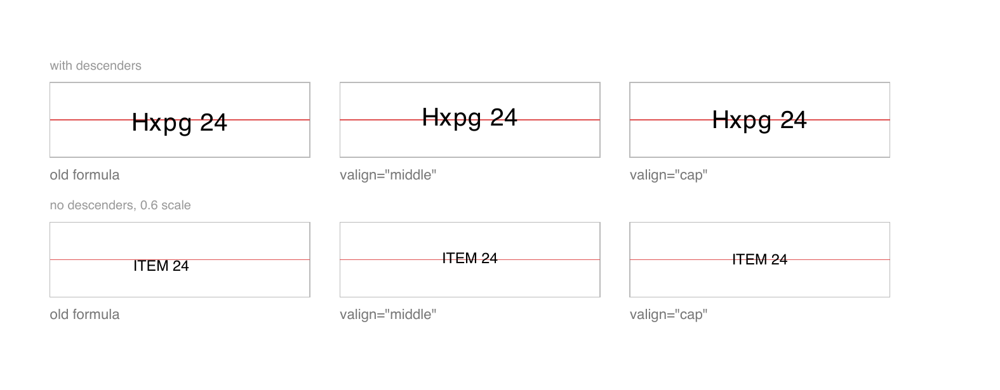

# Reference

## Contents

- [The two coordinate systems](#the-two-coordinate-systems)
- [Creating a document](#creating-a-document)
- [The cursor](#the-cursor)
- [The three placement modes](#the-three-placement-modes)
- [Laying down flowables](#laying-down-flowables)
- [Drawing text](#drawing-text)
- [Font metrics](#font-metrics)
- [TrueType fonts](#truetype-fonts)
- [Shapes](#shapes)
- [Images](#images)
- [Images inside a line](#images-inside-a-line)
- [A tag at the end of a paragraph](#a-tag-at-the-end-of-a-paragraph)
- [Styles](#styles)
- [Header and footer](#header-and-footer)
- [Pagination](#pagination)
- [Frames](#frames)
- [Columns](#columns)
- [Page "x of y" numbering](#page-x-of-y-numbering)
- [Debugging a layout](#debugging-a-layout)
- [Migrating from `pdf_maker`](#migrating-from-pdf_maker)
- [Every name the package exports](#every-name-the-package-exports)

## The two coordinate systems

Two coordinate systems live side by side, and confusing them is the first cause
of layout bugs.

| | Origin | Direction | Unit | Where |
| --- | --- | --- | --- | --- |
| **canvas** | bottom left | `y` grows up | points | `draw_string`, `draw_rect`, `absolute=True`, every `Box` |
| **depth** | top of page | `depth` grows down | points | `doc.cursor.depth` |
| **call coordinates** | left / top margin | `y` grows down | `unit` (mm) | the `x=` and `y=` of `draw_*` without `absolute` |

`PageGeometry` is the only place that converts:

```python
doc.geometry.depth_to_y(depth)   # depth -> canvas ordinate
doc.geometry.y_to_depth(y)       # canvas ordinate -> depth
```

A PostScript point is 1/72 inch. `reportlab.lib.units` provides `mm`, `cm`,
`inch`, `pica`.

## Creating a document

```python
from reportlab_layout import PDFMaker

doc = PDFMaker(
    "output.pdf",           # a path, or a binary file object: see below
    pagesize="A4",          # a reportlab name, or a (width, height) pair in points
    landscape=False,
    unit=mm,                # the unit of the x= and y= passed to draw_* methods
    left=15, right=15, top=15, bottom=15,   # margins, expressed in unit
    font_size=12,           # reference type size, used by add_space()
    stylesheet=None,        # None -> the shared STYLES sheet
    auto_page_break=False,
    show_boundaries=False,
    canvasmaker=Canvas,     # what builds the canvas: NumberedCanvas numbers the pages
)
```

The document is also a context manager: the output is only written if the block
finishes without an exception.

```python
with PDFMaker("output.pdf") as doc:
    doc.draw_paragraph("Hello")
```

Otherwise call `doc.save()` yourself. `save()` draws the last page's header and
footer before writing.

### Writing into memory

The first argument may also be a binary file object: an `io.BytesIO`, a file
opened in `"wb"` mode, a Django `HttpResponse` — anything with a `write` method
that takes bytes. That is how a web view returns a PDF without touching the
disk:

```python
import io

from django.http import FileResponse


def report(request):
    buffer = io.BytesIO()
    with PDFMaker(buffer) as doc:
        doc.draw_paragraph("Third-term report", "Heading1 Centered")
    buffer.seek(0)
    return FileResponse(buffer, as_attachment=True, filename="report.pdf")
```

With Flask, the same buffer goes to
`send_file(buffer, mimetype="application/pdf", download_name="report.pdf")`.

Nothing reaches the file object before `save()`, or before the `with` block
ends. The whole PDF is then written in one go, and the object is **left open**,
because you still have to read or send it. Its position is left at the end of
the PDF, hence the `seek(0)` before handing it on. `buffer.getvalue()` does not
need it.

For type annotations, the accepted types are spelled `OutputLike`, and
`Writable` is the protocol a file object has to meet.

### Geometry attributes

Set at construction, in points, in canvas coordinates:

`width` `height` `left` `right` `top` `bottom` `content_width` `content_height`
`x_left` `x_right` `y_top` `y_bottom` `bottom_depth`

These are mutable snapshots, not properties: a subclass can adjust them as it
goes. The reference geometry stays in `doc.geometry`.

## The cursor

```python
doc.cursor.depth         # current depth, in points; writable
doc.cursor_y             # the same position as a canvas ordinate
doc.cursor_point         # (x_left, cursor_y)
doc.remaining_height     # height left before the bottom margin
doc.cursor.fits(h)       # does an element h points tall still fit?

doc.advance(30)          # move down 30 points
doc.add_space()          # move down one reference type size
doc.add_space(2)         # two of them
doc.reset_cursor()       # back to the top of the content area
```

## The three placement modes

Every `draw_*` method that lays down a flowable takes the same keywords, and
behaves according to what it is given.

**Flow** — neither `x` nor `y`. The element lands under the previous one; the
cursor moves down by its height plus the flowable's own spacing.

```python
doc.draw_paragraph("Lands wherever the cursor is.")
```

**Relative** — `x` and/or `y` given, in `unit`. `y` is a depth from the top of
the page. The cursor **does not move**.

```python
doc.draw_paragraph("40 mm down from the top.", x=20, y=40)
```

**Absolute** — `absolute=True`. `x` and `y` are canvas coordinates in
**points**. The cursor does not move. `valign` says what `y` refers to:

```python
doc.draw_paragraph("Bottom of the block on y.", x=100, y=200, width=200, absolute=True)
doc.draw_paragraph("Middle of the block on y.", x=100, y=200, width=200, absolute=True, valign="middle")
doc.draw_paragraph("Top of the block on y.",    x=100, y=200, width=200, absolute=True, valign="top")
doc.draw_paragraph("Capitals centred on y.",    x=100, y=200, width=200, absolute=True, valign="cap")
```

A paragraph's text does not sit in the middle of its block: `cap` centres the
capitals instead. See [`cap` on a paragraph](#cap-on-a-paragraph).

`halign` says what `x` refers to, as it does for `draw_string`: the element's
left edge (the default), its middle, or its right edge. The width is the one the
element wraps to — a table's columns, an image's width, a paragraph's `width`:

```python
doc.draw_table(rows, col_widths=[120, 60], x=doc.width / 2, y=700, absolute=True, halign="center")
doc.draw_image(logo, width=40 * mm, x=doc.x_right, y=doc.y_top, absolute=True, halign="right", valign="top")
```

## Laying down flowables

```python
doc.draw(flowable, **kwargs)                      # any reportlab flowable
doc.draw_paragraph(text, style=None, **kwargs)
doc.draw_table(data, col_widths=None, row_heights=None, style=None, repeat_rows=0, **kwargs)
doc.draw_image(spec, width=None, height=None, scale=None, **kwargs)
doc.draw_centered_line(y=None, wscale=1.0, stroke=None, line_width=0.5)
```

The keywords `draw` shares with all of them:

| Keyword | Effect |
| --- | --- |
| `x`, `y` | position, in `unit` (or in points with `absolute`) |
| `width`, `height` | the space offered to the flowable for its wrapping |
| `before` | space added before, in `unit` |
| `absolute` | raw canvas coordinates |
| `halign` | `"left"`, `"center"`, `"right"` — with `wscale` in flow; in absolute mode, the point of the element on `x` |
| `valign` | `"bottom"`, `"middle"`, `"top"`, and `"cap"` for a paragraph — **in absolute mode only** |
| `wscale` | fraction of the content width the block occupies |
| `page_break` | `None` follows `auto_page_break`; `True`/`False` force it |
| `show_boundary` | outline the element's box |

Every call returns a `Box`:

```python
box = doc.draw_paragraph("Hello")
x, y, width, height = box            # unpacks as a plain 4-tuple
box.right, box.top, box.center       # bottom-left corner plus conveniences
```

In flow, `wscale` and `halign` go together: `wscale=0.5, halign="right"` lays a
half-width block against the right margin. There `halign` places a block
`wscale` content widths wide and never looks at the element's own width, so on
its own it does nothing. To centre an image, see [Images](#images). In absolute
mode, `halign` uses the element's width and `wscale` is ignored.

### Several flowables as one block

```python
from reportlab.platypus import KeepTogether

box = doc.draw(KeepTogether([heading, first_paragraph]))
```

`draw` lays a `KeepTogether` as one block: its flowables one under the other,
spaced as in a frame, in a box as tall as they make together, which is the box
returned. reportlab's own `KeepTogether` reports 16777215 pt, for a frame to
split it, and has nothing to draw: `draw` measures and draws what it holds
instead. With `auto_page_break`, the block moves to the next page whole when
what is left of this one cannot hold it, and a group that no page can hold
flows over the pages from the cursor, as a paragraph that long would. In
absolute mode, `halign` and `valign` place the box; `"cap"` is refused, as for
any flowable but a paragraph. A flowable narrower than the widest is placed by
its own `hAlign`, as in [Columns](#columns).

### Factories

To build a flowable without laying it down — useful for a header, a footer, or a
table cell:

```python
doc.make_paragraph(text, style=None)
doc.make_spacer(space=1)                 # in reference type sizes
doc.make_table(data, col_widths=None, row_heights=None, repeat_rows=0)
doc.make_image(spec, width=None, height=None, scale=None)
```

### Tables

Without `col_widths` the content width is split evenly; a scalar applies to
every column; a list sets them one by one.

`style` takes a sequence of reportlab commands, or a `TableStyle` already built:

```python
doc.draw_table(
    [["Name", "Mark"], ["HOPPER", "17"]],
    col_widths=[40 * mm, doc.content_width - 40 * mm],
    style=[
        ("VALIGN", (0, 0), (-1, -1), "MIDDLE"),
        ("GRID", (0, 0), (-1, -1), 0.4, "#999999"),
        ("BACKGROUND", (0, 0), (-1, 0), "#f2f2f2"),
    ],
)
```

For text that has to wrap inside a cell, put a `Paragraph` there rather than a
string:

```python
cells = [[doc.make_paragraph(c, "Small") for c in row] for row in data]
```

With `auto_page_break`, a table that would overflow the bottom margin moves to a
new page, in one piece, when a page can hold it. One taller than the content
area is split between two rows instead: its first part fills what is left of the
page, the rest carries on over as many pages as it takes — 80 rows of one line
make 1440 points, nearly twice the height of an A4 page. `repeat_rows` repeats
the heading rows at the top of every part:

```python
doc.draw_table([heading, *rows], repeat_rows=1)
```

The box returned is then the last part's, on the last page, and the cursor
carries on under it. See [Pagination](#pagination).

To split a table that a page could hold, rather than move it whole, hand it to
[`draw_columns`](#columns) with a single column, which fills what is left of the
page first:

```python
table = doc.make_table([heading, *rows], col_widths=[120, 60], repeat_rows=1)
doc.draw_columns([table], columns=1)
```

`draw_columns` lays a flowable as a platypus frame does, by the flowable's own
`hAlign`: reportlab centres a table or an image by default, so a table narrower
than the content area comes out centred there, where `draw_table` sets it
against the left margin.

## Drawing text

One method, in canvas coordinates and points.

```python
doc.draw_string(
    text, x, y,
    style=None,        # a style name, a ParagraphStyle, or None for Normal
    scale=1.0,         # multiplies the style's type size
    color=None,        # a tuple, "#rrggbb", a CSS name, or a reportlab Color
    halign="left",     # left | center | right
    valign="baseline", # baseline | middle | cap | top | bottom
    angle=0,           # rotation about the anchor, counterclockwise
    dx=0, dy=0,        # nudge after anchoring, for optical corrections
)
```

Vertical anchors, `y` meaning:

| `valign` | what `y` refers to |
| --- | --- |
| `baseline` | the baseline — what `canvas.drawString` does |
| `middle` | the middle of the em box, descender room included |
| `cap` | the middle of the cap box — **the anchor for labels** |
| `top` | the top of the em box |
| `bottom` | the bottom of the em box |

Rotation is clean: the canvas is saved, translated to the anchor, rotated, then
restored. `angle=90` reads bottom to top.

```python
doc.draw_string("Week 12", x, y, angle=90, halign="center", valign="cap")
```

To draw with the canvas yourself, `apply_style` arms the font and colour and
returns the metrics:

```python
metrics = doc.apply_style("Heading2", scale=0.8, color="#333333")
doc.canvas.drawString(x, y, "drawn by hand")
```

### `middle` or `cap`?

Both are exact. They simply centre different things.

`middle` centres the **em box**, which reserves room for descenders even when
the string has none. On a label like `Exam 3` the ink then sits high by about
10% of the type size.

`cap` centres the **cap box**, from the baseline to the height of the capitals.
On short labels the ink lands within a tenth of a point of the middle of its
box; and because the reference does not depend on which glyphs are present, a
row of labels shares one baseline whether or not they have descenders. That is
what a table cell, a banner or a badge wants.

Ink-centre error measured on Helvetica labels in a 16 pt row:

| Label | size | `middle` | `cap` |
| --- | --- | --- | --- |
| `Exam 3` | 9.5 pt | +0.89 pt | −0.09 pt |
| `Lab work` | 8.5 pt | +0.81 pt | −0.07 pt |
| `Test A1` | 6.5 pt | +0.61 pt | −0.05 pt |
| `Room 204` | 8 pt | +0.75 pt | −0.07 pt |
| `September` | 12 pt | +0.10 pt | −1.14 pt |



The red rule marks the exact middle of each box. Left, the formula this package
used to get wrong; middle, `valign="middle"`; right, `valign="cap"`. The bottom
row is drawn at 0.6 scale, which is also where the old code's horizontal
centring drifts.

`September` shows the limit: its `p` descends and drags the ink box down. That
is intended — across a row of month banners you want `March` and `September` to
share a baseline, not each to centre its own ink.

A constant `dy` on a `draw_string` is almost always the symptom of a wrong
anchor: it tracks neither the type size nor the scale.

These figures can be measured again with
[`scripts/centering_proof.py`](../scripts/centering_proof.py) and
[`scripts/cap_height_probe.py`](../scripts/cap_height_probe.py).

### `cap` on a paragraph

`draw_string` does not wrap: text that has to be laid out goes through
`draw_paragraph`. Placed with `absolute=True`, a paragraph takes `cap` too, and
`y` is then the middle of its capitals, from the cap height of the first line
down to the baseline of the last. That is the anchor for a title centred on a
page or in a banner:

```python
doc.draw_paragraph(title, "Heading1 Centered", x=doc.x_left, y=doc.height / 2,
                   width=doc.content_width, absolute=True, valign="cap")
```

`middle` centres the block, but the text does not sit in the middle of its
block. reportlab hangs the first baseline one type size below the top of the
block, and leaves `leading − size` under the last one. The capitals therefore
lie `size − (leading + cap height) / 2` below the middle of the block, however
many lines there are. Set solid, as a title often is, they sit low by 14% of
the type size in Helvetica and 17% in Times; under a loose leading they sit
high instead.

Ink-centre error measured on a paragraph in capitals, centred on a page:

| Style | lines | `middle` | `cap` |
| --- | --- | --- | --- |
| Helvetica 15 on 15 | 2 | −2.11 pt | +0.02 pt |
| Helvetica 10 on 12 | 2 | −0.39 pt | +0.03 pt |
| Helvetica 12 on 18 | 2 | +1.31 pt | +0.02 pt |
| Helvetica-Bold 20 on 22 | 3 | −1.80 pt | +0.02 pt |
| Times-Roman 14 on 14 | 2 | −2.35 pt | +0.02 pt |

The `middle` column matches the formula above to 0.02 pt. In lower case,
descenders pull the ink below the last baseline: set in the first row's style,
`Please be wrapped, centered horizontally and vertically!!` lands 3.72 pt low
with `middle` and 1.59 pt low with `cap`. That is the choice made for
`September` above: the capitals are the reference. A one-line title anchored
on `cap` thus gets the baseline of a `draw_string` anchored on `cap` at the
same `y`, and the two line up.

`cap` works from the paragraph's style, its font and its size, and from the
line pitch reportlab actually used, `autoLeading` included. reportlab's
`paraFontSizeHeightOffset` setting, which drops the first line by the ascent
rather than the size, is followed as well. A size changed by markup inside the
paragraph, such as `<font size="20">`, is not taken into account.

A table or an image has no capitals: `valign="cap"` raises `ValueError` for
them, rather than quietly falling back to `middle`, which is the anchor to use.
Like the other anchors, `cap` only applies in absolute mode.

These figures can be measured again with
[`scripts/paragraph_cap_probe.py`](../scripts/paragraph_cap_probe.py). They come
from poppler on macOS, which draws Helvetica and Times with Apple's fonts. On
Linux it takes the URW clones, whose Nimbus Sans sets its capitals 11
thousandths of an em higher than Helvetica. The middle of the ink rises by half
that, 0.11 pt at 20 pt: the viewer's font, not the anchor.

## Font metrics

```python
from reportlab_layout import TextMetrics, string_width, font_height, baseline_offset

m = TextMetrics(style, scale=0.5)
m.font_name, m.font_size, m.leading
m.ascent      # > 0
m.descent     # < 0
m.height      # ascent - descent, the height of the em box
m.cap_height  # height of the capitals above the baseline
m.baseline_offset            # (ascent + descent) / 2, the em-centring offset
m.cap_offset                 # cap_height / 2, the cap-centring offset
m.width("Hello")
m.baseline(y, "middle")      # baseline for a given anchor
m.left_edge(x, "Hello", "center")
```

Every metric accounts for `scale`. That is the point: measuring at the nominal
size and then drawing at `scale=0.5` gets the centring wrong by a factor of two,
horizontally as much as vertically.

`cap_height` deserves a note: reportlab does not expose it for the fourteen
standard PostScript fonts, only the ascent — which equals the cap height for
Helvetica, but overshoots it by 3% for Times and 12% for Courier. So the package
carries the table published in Adobe's AFM files (`STANDARD_CAP_HEIGHTS`), reads
`face.capHeight` when the font declares one (TrueType), and falls back to the
ascent as a last resort.

`doc.metrics(style, scale)` returns the same object, resolving the style against
the document's stylesheet.

## TrueType fonts

The fourteen standard fonts stop at Latin-1: a Polish ł, a Romanian ș, a Greek
letter or an arrow come out as black boxes. A TrueType font covers them, and
embeds its glyphs, so the text still extracts. `register_font_family` registers
the faces of a family together, and tells reportlab which is which, so that
`<b>` and `<i>` switch faces inside a paragraph:

```python
from reportlab_layout import add_style, register_font_family

family = register_font_family(
    "Gentium",
    "fonts/Gentium-Regular.ttf",
    bold="fonts/Gentium-Bold.ttf",
    italic="fonts/Gentium-Italic.ttf",
    bold_italic="fonts/Gentium-BoldItalic.ttf",
)
add_style(doc.stylesheet, "Body", fontName=family, fontSize=10.5, leading=13)
doc.draw_paragraph("Łódź, <b>Brașov</b>, <i>Ελλάδα</i>", "Body")
```

The faces are registered as `Gentium`, `Gentium-Bold`, `Gentium-Italic` and
`Gentium-BoldItalic`, names a `draw_string` style can use too. A face left out
takes the closest one given: bold and italic the regular face, bold italic the
bold, else the italic, else the regular.

Registering the same family again with the same files does nothing, so a module
can do it when imported; with other files, or under the name of a standard font,
it raises `ValueError` rather than change documents already using the name.

Two limits come from reportlab:

- only TrueType outlines are read: an OpenType font with PostScript outlines
  (CFF, the usual `.otf`) has to be converted first;
- the cap height comes from the font's OS/2 table, and a table older than
  version 2 has none: reportlab then uses the ascent, which drops `valign="cap"`
  far too low. Such a face is reported in the log; centre its labels with
  `middle`.

## Shapes

Canvas coordinates, in points. Every call returns a `Box` and leaves no state
behind on the canvas.

```python
doc.draw_line(x1, y1, x2, y2, stroke="black", line_width=0.5)
doc.draw_rect(x, y, w, h, fill=None, stroke="black", line_width=0.5)
doc.draw_round_rect(x, y, w, h, radius=5, fill=None, stroke="black", line_width=0.5)
doc.draw_ellipse(x, y, radius_x, radius_y, fill=None, stroke="black", line_width=0.5)
doc.draw_circle(x, y, radius, fill=None, stroke="black", line_width=0.5)
doc.draw_polygon(points, close=True, fill_mode=FILL_NON_ZERO, line_join=None)
doc.draw_regular_polygon(x, y, radius, vertices=5, leap=1, start_angle=90)
```

`fill=None` leaves the inside empty; `stroke=None` drops the outline. Colours
accept a 3- or 4-tuple in `0..1`, a `"#rrggbb"` string, a CSS name, or a
reportlab `Color`. `radius` is clamped to half the shorter side.

`draw_ellipse` and `draw_circle` take a **centre** and radii, not a bounding box:
a shape defined by a centre is nearly always placed by its centre, and
reportlab's own corner-to-corner form makes that an arithmetic chore at every
call site. `draw_circle` is `draw_ellipse` with equal radii.

`draw_regular_polygon` inscribes the shape in a circle of `radius`. `leap` is
how many vertices each edge skips — the *k* of the Schläfli symbol {n/k}, so
`leap=1` gives a convex polygon and `vertices=5, leap=2` the five-pointed star.
`start_angle` is in degrees counterclockwise from east, the default 90 putting a
vertex straight up. `leap` must be coprime with `vertices`: {6/2} would close
after three vertices and quietly draw a triangle instead of the hexagram, which
needs two separate paths, so that combination raises.

`fill_mode` only matters for a self-crossing path, and there it decides the whole
look:

```python
doc.draw_regular_polygon(x, y, 20, vertices=5, leap=2, fill="black")                 # solid star
doc.draw_regular_polygon(x, y, 20, vertices=5, leap=2, fill="black", fill_mode=0)    # hollow centre
```

`line_join` takes reportlab's codes — 0 mitre, 1 round, 2 bevel. Sharp points at
a small size usually read better rounded, a mitre spike extending well past the
vertex.

## Images

```python
from reportlab_layout import image_spec, load_image

spec = image_spec("logo.png")        # reads the pixel size once
spec.width, spec.height, spec.aspect
spec.scaled(width=50 * mm)           # -> (width, height) in points

doc.draw_image(spec, width=30 * mm)  # aspect ratio preserved
doc.draw_image("logo.png", height=20 * mm)
doc.draw_image(spec, scale=0.5)
```

Giving `width` **and** `height` forces the ratio, which is sometimes what you
want. Giving none of them raises `ValueError` rather than guessing.

In the flow, an image lands against the left margin. `halign="center"` alone
does not move it: it centres a block `wscale` content widths wide, and `wscale`
defaults to the full width. Give the image's width as a fraction too:

```python
width = 60 * mm
doc.draw_image(spec, width=width, wscale=width / doc.content_width, halign="center")
```

The same goes for a table narrower than the content width. In absolute mode,
`halign="center"` centres the image on `x` from its own width, with nothing
else to give:

```python
doc.draw_image(spec, width=60 * mm, x=doc.width / 2, y=400, absolute=True, halign="center")
```

## Images inside a line

reportlab takes an `` tag in a paragraph's markup, but stands the image
0.2 em below the baseline, wherever the image's own baseline is. That suits an
icon, not text turned into an image — a formula typeset by TeX, a word in
another script — which has to sit on the line's baseline, its depth below it.
`inline_image` writes the tag that does that:

```python
from reportlab_layout import InlineParagraph, add_style, inline_image

formula = inline_image("formula.png", width=31.2, height=12.4, depth=3.1)
add_style(doc.stylesheet, "Body", fontSize=10, leading=12, autoLeading="max")
doc.draw(InlineParagraph(f"Hence {formula}, as expected.", doc.stylesheet["Body"]))
```

`width`, `height` and `depth` are in points; given one dimension only, the file
is read for its aspect ratio.

The line has to make room for a tall image, which takes `autoLeading="max"` on
the style: without it, the image overprints the line above. With a plain
`Paragraph`, that is not enough, for two reasons that `InlineParagraph`
corrects:

- reportlab hangs the first baseline one type size below the top of the block,
  whatever the line holds, so a formula on the **first** line sticks out above
  the paragraph by its extra height, over the block before it, while the same
  amount is left empty at the bottom. `InlineParagraph` lowers the paragraph by
  that much when it draws;
- when a wrap puts an image at the **head** of a line, reportlab's
  `breakLines` gives the line the ascent and descent of its font, not of the
  image, which then overprints the block below. `InlineParagraph` measures each
  line again from its words.

An ordinary paragraph, with no image and no size change, is drawn exactly as
reportlab draws it.

`InlineParagraph.baselines()` gives the baseline of every line as drawn, above
the bottom of the block, once the paragraph is wrapped.

## A tag at the end of a paragraph

`TaggedParagraph` sets a tag flush right on the last line, as LaTeX does with
`\hfill` at the end of a paragraph: the points of an exam question, a
reference, a page number. When the last line has no room left, the tag goes on
a line of its own, still flush right.

```python
from reportlab.lib.styles import ParagraphStyle
from reportlab_layout import TaggedParagraph

points = ParagraphStyle("points", fontName="Courier-Bold", fontSize=7)
question = TaggedParagraph("Show that the energy is conserved.", doc.stylesheet["Body"], tag="(2 pts)", tag_style=points)
doc.draw(question)
```

The tag is markup, in its own style — the paragraph's by default. `gap` is the
least room kept between the text and the tag, half the type size by default.
The paragraph splits across columns and pages as any other; the tag goes with
its last part. It builds on `InlineParagraph`, so inline images are welcome, and
a bullet too: with `bulletAnchor="end"`, the bullet hangs flush right in the
indent, as a LaTeX `\item[label]` does.

The text is meant to be aligned left or justified: a centred or right-aligned
last line has no free end for the tag.

## Styles

```python
from reportlab_layout import make_stylesheet, add_style, STYLES
```

`make_stylesheet()` returns a **fresh** sheet each call: reportlab's, plus
`Left`, `Right`, `Centered`, `Justify`, `Small`, `Footer`, `Heading1 Centered`
and `Heading1 Left`.

`STYLES` is a module-level shared sheet. Handy in a script, dangerous in a
library: two modules adding the same name to it collide. As soon as a document
has styles of its own:

```python
styles = make_stylesheet()
add_style(styles, "Banner", parent="Heading1", fontSize=24, leading=28)
add_style(styles, "Fineprint", parent="Small", textColor="#555555")

doc = PDFMaker("output.pdf", stylesheet=styles)
doc.draw_paragraph("Document title", "Banner")
```

`add_style` replaces an existing style rather than raising `KeyError` — a
re-imported module no longer breaks. `replace=False` restores reportlab's
behaviour.

Anywhere a style is expected you may give its name, a `ParagraphStyle`, or
`None` for `Normal`.

## Header and footer

Redrawn on every page, without touching the cursor.

```python
doc.set_footer(doc.make_paragraph("Revision of 25 August 2026", "Right"))
doc.set_header([logo, doc.make_paragraph("Acme Ltd", "Centered")])
```

Both live in the margins, which leaves the content area to the flow. The header
stands on the top edge of the content area, in the top margin. The footer hangs
from its bottom edge, in the bottom margin. The cursor starts right under the
header. Both are drawn by `new_page()` and by `save()`.

```text
┌──────────────────────────────┐
│ top margin       HEADER      │
├──── top of the content ──────┤ ← the cursor starts here
│ the flow                     │
├──── bottom of the content ───┤
│ bottom margin    FOOTER      │
└──────────────────────────────┘
```

So the margins are all the room they get. Give the header a `top` margin tall
enough for it, and the footer a `bottom` margin: anything that sticks out past
the edge of the page is logged as a warning, once per document. The gap between
them and the content comes from their style: the header's `spaceAfter`, the
footer's `spaceBefore`.

```python
styles = make_stylesheet()
add_style(styles, "Header", parent="Small", spaceAfter=6)

doc = PDFMaker("output.pdf", top=25, stylesheet=styles)
doc.set_header(doc.make_paragraph("Acme Ltd — quarterly report", "Header"))
```

A paragraph in the header stands on its descenders, not on the bottom of its
block. reportlab leaves only `leading − size` under a paragraph's last baseline:
2 pt in 10/12, where the descenders reach 2.07 pt down, and nothing at all when
the text is set solid. The header rises by the difference, so that its descent
line stands `spaceAfter` above the content: by 0.07 pt in 10/12, by 3.3 pt in
Helvetica 16/16. Under a loose leading the block already clears them, and
nothing moves.

The descent is the one the font declares, the one `draw_string` anchors
`bottom` on. The glyphs a viewer draws can reach a hair lower, and a rule drawn
on the top edge of the content area, such as the top border of a table laid
first, sticks out above it by half its width: a header right against it still
touches it. Give the header a `spaceAfter` of a few points there.

When a header or footer holds several flowables, they all line up on the same
edge instead of stacking. That is how a logo on the left and a centred title
share one band. Their paragraphs share a baseline — the last line's in a header,
the first line's in a footer — set as far from the content as the one that needs
it most, so that a heading and a line of small print side by side read as one
line. Anything else, an image or a table, keeps its block against the edge.

`doc.header` and `doc.footer` are plain lists; you may assign to them directly.
`new_page` and `save` call `draw_header_footer` for you; call it yourself only
to stamp a band onto a page you are closing by hand.

## Pagination

```python
doc.new_page()      # draws header and footer, turns the page, resets the cursor
doc.page            # current page number
```

With `auto_page_break=True`, an element that would overflow the bottom margin
starts a new page before it is laid down.

```python
doc = PDFMaker("output.pdf", auto_page_break=True)
```

It moves whole: a paragraph that a page can hold is never split, and the room
it leaves at the foot of the page stays empty. To break a long text where the
page ends, lay it with `draw_columns(story, columns=1)`, which splits it. To
move a heading to the next page with the paragraph under it, lay the two as
[one block](#several-flowables-as-one-block).

An element taller than the content area, which no page could hold, is split
instead: from the cursor, over as many pages as it takes — a paragraph between
two lines, a table between two rows, repeating its `repeat_rows`. `draw` returns
the box of the last part, and the cursor carries on under it. A block that
cannot split, such as an image or a table row taller than the page, is laid at
the top of a page anyway, overflowing it, and a warning goes to the log.

`page_break=False` on one call disables the break for that element;
`page_break=True` enables it even if the document did not ask for it.

The break only happens in flow mode: an element given an explicit position lands
where you said.

## Frames

A frame is a fixed-height box reportlab fills on its own, handling the wrapping,
and stops filling once it is full.

```python
doc.new_frame(height=60, wscale=0.5, show_boundary=True)
leftover = doc.frame_paragraph("Some text that wraps inside the box.")
doc.frame_image("logo.png", width=30 * mm)
doc.frame_space(1)
```

Whatever did not fit is **returned** by the call and reported in the logs,
rather than vanishing silently. `new_frame` moves the cursor down by the frame's
height.

`doc.draw_frame(story, space=0)` writes a list of flowables in one go.

## Columns

`draw_columns` flows a story over columns, from the cursor, onto as many pages
as it takes:

```python
story = [doc.make_paragraph(text, "Body") for text in answers]
box = doc.draw_columns(story, columns=2, gap=5)
doc.draw_paragraph("Below the columns, across the whole width.")
```

`gap` is the space between two columns, in `unit`. Every page but the last is
filled down to the bottom margin, then a new page is opened, header and footer
drawn as usual. On the last page, the columns are **balanced**, as LaTeX's
`multicols` balances them: the lowest height at which the rest of the story
still fits, so they end level rather than one full and one short. The cursor
then moves under them, and the box they cover on that page is returned.
`balance=False` fills the first column first, to the bottom of the page.

- Space before and after is kept as a frame keeps it: none at the top of a
  column, none counted at its bottom.
- A `FrameBreak` in the story ends its column; a `KeepTogether` moves its
  content to the next column when it does not fit in what is left of this one.
  One that no column can hold, met at the top of a page, lets its content
  split over the columns, as if it were not grouped.
- A flowable whose style asks `keepWithNext` — a heading — stays with the next
  one, as in a `SimpleDocTemplate`: platypus does that in its document
  template, so the columns bind such runs themselves (`keep_with_next`).
- When nothing fits in what is left of the page, the columns start on the next
  one.
- A flowable that cannot split and is taller than a whole column is laid down
  anyway, overflowing it, and reported in the log: neither lost, nor an endless
  loop.
- A flowable narrower than its column is placed by its own `hAlign`, as in a
  platypus frame. reportlab gives a table and an image `"CENTER"`, so they come
  out centred in the column, where `draw` sets them against the left margin;
  set `table.hAlign = "LEFT"` to keep them there.
- With a single column, `draw_columns` splits a paragraph or a table where the
  page ends, heading rows repeated, rather than moving it whole to the next
  page as `draw` does.

The balanced height is found by trying heights, a dozen times or so. The trials
only wrap and split the flowables: nothing is drawn until the last, and an image
is not loaded at every trial. `pack_columns` and `balanced_height`, which do the
work, are public, for columns inside a frame of your own.

### Packing columns yourself

```python
from reportlab_layout import balanced_height, pack_columns

height = balanced_height(doc.canvas, story, width, room, columns=2)
packing = pack_columns(doc.canvas, story, width, height, columns=2)
for placement in packing.placements:
    placement.flowable.drawOn(doc.canvas, x + placement.column * pitch, y - placement.bottom)
```

`pack_columns` draws nothing: it wraps the flowables, splits them where a column
ends, and returns a `Packing`.

| `Packing` | |
| --- | --- |
| `placements` | the flowables that fit, each as a `Placement` |
| `rest` | what is left over, for the next page |
| `height` | the depth the lowest flowable reaches, its space after left out |

| `Placement` | |
| --- | --- |
| `flowable` | the flowable, already wrapped — and split, where it had to be |
| `column` | which column it landed in, counting from 0 |
| `top` | the depth of its top below the top of the columns |
| `width`, `height` | what it wrapped to |
| `bottom` | `top + height`, for convenience |

Both are frozen dataclasses. Depths grow downwards, like the cursor's, so a
canvas ordinate is `top_of_the_columns - placement.top`.

`overflow=True` lays down a flowable that cannot split and does not fit an empty
column anyway, rather than leaving it in `rest` for ever — what `draw_columns`
does for columns as tall as the page. A `KeepTogether`, which has nothing to
draw, gives way to its flowables there instead.

## Page "x of y" numbering

Since the page count is only known at the end, you need a canvas that records
the pages and replays them. `NumberedCanvas` does, and a `PDFMaker` takes it as
its `canvasmaker`, as a platypus template does:

```python
from reportlab_layout import NumberedCanvas, PDFMaker

with PDFMaker("output.pdf", auto_page_break=True, canvasmaker=NumberedCanvas) as doc:
    doc.draw_paragraph(text)
```

```python
from reportlab.platypus import SimpleDocTemplate

SimpleDocTemplate("output.pdf").build(story, canvasmaker=NumberedCanvas)
```

It also works as a standalone canvas, with no `DocTemplate` — that is the
difference from the recipe that circulates, which silently loses the last page
in that case.

The folio is set flush right, its end 15 mm from the right edge of the page and
its baseline 10 mm above the bottom, whatever the page size. To change how it
looks:

```python
class Folio(NumberedCanvas):
    folio_inset = (20 * mm, 8 * mm)      # from the bottom-right corner of any page
    folio_font = ("Helvetica-Oblique", 8)
    folio_label = staticmethod(lambda page, total: f"— {page} / {total} —")
```

`folio_position = (x, y)` pins the end of the folio to one point instead, on
every page. Or override `draw_folio(page, total)` for full control.

The canvas draws the folio outside the document's layout, and knows nothing of
its footer: leave it room in the bottom margin. "Page x" alone needs no special
canvas. `draw_header_footer` runs as each page closes, `doc.page` still that
page's number, so a subclass can rebuild its footer there:

```python
class Report(PDFMaker):
    def draw_header_footer(self):
        self.set_footer(self.make_paragraph(f"Page {self.page}", "Right"))
        super().draw_header_footer()
```

`doc.canvas` may also be replaced after construction, before anything is drawn:
`draw_string`, `draw_rect` and the other painters follow it onto the new canvas.

## Debugging a layout

`show_boundaries=True` at construction, or `show_boundary=True` on one call,
outlines the box of every element laid down.

The package logs through `logging` and never prints:

```python
import logging
logging.basicConfig(level=logging.DEBUG)
```

`reportlab_layout.document` emits page changes and frame creations at `DEBUG`.
At `WARNING` it reports what a viewer would not show you:

- an element laid by `draw` — in flow, relative or absolute — that runs past an
  edge of the page, with the page and the distance:
  `Table runs off page 1: 440.0 pt past its bottom edge`;
- a header taller than the top margin, or a footer taller than the bottom one,
  once per document rather than once per page.

The shapes and strings drawn straight onto the canvas — `draw_string`,
`draw_rect` and the like — are not watched: a background may bleed off the page
on purpose. `reportlab_layout.frames` reports a frame's overflow at `WARNING`.
`reportlab_layout.columns`, which splits the blocks `draw` spreads over pages as
well as the columns, reports a flowable that cannot split and overflows the
column it is laid in: `Image is 900.0 pt tall and cannot split: it overflows a
756.9 pt column`.

## Migrating from `pdf_maker`

This package grew out of a private module called `pdf_maker`. If you are coming
from it, the API moved to `snake_case` and several signatures changed.

| Before | After |
| --- | --- |
| `from pdf_maker import …` | `from reportlab_layout import …` |
| `PDFMaker(f, fontsize=, verbose=, showboundaries=, autobreak=)` | `PDFMaker(f, font_size=, show_boundaries=, auto_page_break=)` (no more `verbose`: `logging`) |
| `self.c` | `self.canvas` |
| `self.cursor` (a float) | `self.cursor.depth` |
| `self.coord()` | `self.cursor_point`, `self.cursor_y` |
| `activewidth`, `activeheight` | `content_width`, `content_height` |
| `activebottom`, `bottomheight` | `bottom_depth`, `remaining_height` |
| `self.foot`, `self.head` | `self.footer`, `self.header` |
| `self.space` | `self.default_space` |
| `self.today` | gone — formatting a date is the caller's business |
| `savePDF()` | `save()` |
| `newPage()`, `addSpace()`, `addcursor(h)` | `new_page()`, `add_space()`, `advance(h)` |
| `setMeta()` | `set_metadata()` |
| `getParagraph/getTable/getSpace` | `make_paragraph/make_table/make_spacer` |
| `drawParagraph/drawTable/drawImage` | `draw_paragraph/draw_table/draw_image` |
| `drawCenteredLine`, `drawRect`, `drawRectRounded` | `draw_centered_line`, `draw_rect`, `draw_round_rect` |
| `set_style(n, size=, rgb=)` | `apply_style(n, scale=, color=)` |
| `drawStringCenterH(x, y, s, …)` | `draw_string(s, x, y, halign="center")` |
| `drawStringCenterHV(x, y, s, …)` | `draw_string(s, x, y, halign="center", valign="cap")` |
| `drawStringCenterHVVertical(x, y, s, …)` | `draw_string(s, x, y, halign="center", valign="cap", angle=90)` |
| `drawStringLeftCenterV(x, y, s, …)` | `draw_string(s, x, y, valign="cap")` |
| `topage=True` | `absolute=True` |
| `w=`, `h=`, `colwidth=` | `width=`, `height=`, `col_widths=` |
| `fillRGB=`, `strokeRGB=`, `lw=`, `round=` | `fill=`, `stroke=`, `line_width=`, `radius=` |
| `imspecs()`, `get_image(…, largeur=)` | `image_spec()`, `load_image(…, width=)` |
| `drawParagraph` returned `(p, (x, y, w, h))` | every method returns a `Box` |
| the shared global `styles` | `make_stylesheet()`, passed via `stylesheet=` |

Two changes will not show up when re-reading the code:

- **Vertically centred text moves up** by about 20% of the type size. That is
  the correction; any positions hand-tuned to compensate for the old offset need
  revisiting. Short labels should move to `valign="cap"` and lose their `dy`.
- **`before=` is now in `unit`** everywhere. It used to be in `unit` for
  positioning and in points for advancing the cursor, which shifted everything
  that followed.

## Every name the package exports

Everything below comes straight from `reportlab_layout`. Most of it you reach
through a `PDFMaker`, which wraps the painters and the factories; the rest is
there for the times you want a piece on its own.

```python
from reportlab_layout import PDFMaker, make_stylesheet, add_style
```

### The document

| Name | What it is | Where |
| --- | --- | --- |
| `PDFMaker` | a document built page by page, with a flow cursor | [Creating a document](#creating-a-document) |
| `OutputLike` | what `PDFMaker` takes as its output: a path or a file object | [Writing into memory](#writing-into-memory) |
| `Writable` | the protocol a file object has to meet — a `write` taking bytes | [Writing into memory](#writing-into-memory) |
| `NumberedCanvas` | a canvas that stamps "page x of y" once the count is known | [Page "x of y" numbering](#page-x-of-y-numbering) |
| `__version__` | the installed version, as a string | |

### Geometry

| Name | What it is | Where |
| --- | --- | --- |
| `PageGeometry` | page size and margins, and the content area they leave | [The two coordinate systems](#the-two-coordinate-systems) |
| `Margins` | the four margins, in points; `Margins.build` takes them in `unit` | [The two coordinate systems](#the-two-coordinate-systems) |
| `Cursor` | the writing depth, behind `doc.cursor` | [The cursor](#the-cursor) |
| `Box` | the rectangle a drawing occupied, returned by every call | [Laying down flowables](#laying-down-flowables) |
| `resolve_pagesize` | a name such as `"A4"`, or a pair, to a `(width, height)` in points | [Creating a document](#creating-a-document) |

### Text and its metrics

| Name | What it is | Where |
| --- | --- | --- |
| `TextPainter` | draws anchored strings, behind `doc.text` and `doc.draw_string` | [Drawing text](#drawing-text) |
| `TextMetrics` | a style's metrics at a given scale, and the anchor arithmetic | [Font metrics](#font-metrics) |
| `string_width` | the width of a string in a style | [Font metrics](#font-metrics) |
| `font_ascent`, `font_descent` | how far a style reaches above and below the baseline | [Font metrics](#font-metrics) |
| `font_height` | the height of its em box, `ascent - descent` | [Font metrics](#font-metrics) |
| `cap_height` | the height of its capitals | [Font metrics](#font-metrics) |
| `baseline_offset` | what to subtract from a target centre to get the baseline | [`middle` or `cap`?](#middle-or-cap) |
| `register_font_family` | registers a TrueType family so `<b>` and `<i>` switch faces | [TrueType fonts](#truetype-fonts) |

The five metric functions are shortcuts onto `TextMetrics`; reach for the class
when you want several figures at once, since it computes them from one lookup.

### Styles and colours

| Name | What it is | Where |
| --- | --- | --- |
| `make_stylesheet` | a fresh stylesheet, extended with the usual alignments | [Styles](#styles) |
| `add_style` | adds or replaces a style derived from a parent | [Styles](#styles) |
| `STYLES` | the shared default stylesheet — convenient, and a trap in a library | [Styles](#styles) |
| `StyleLike` | a style, its name, or `None` for `Normal` | [Styles](#styles) |
| `resolve_style` | turns any of those three into a `ParagraphStyle` | [Styles](#styles) |
| `ColorLike` | a `Color`, a CSS name, `"#rrggbb"`, or a tuple in `0..1` | [Shapes](#shapes) |
| `to_color` | turns any of those into a reportlab `Color` | [Shapes](#shapes) |

### Shapes, images and frames

| Name | What it is | Where |
| --- | --- | --- |
| `ShapePainter` | rules, rectangles, ellipses and polygons, behind `doc.shapes` | [Shapes](#shapes) |
| `ImageSpec` | an image's path and pixel size, read once | [Images](#images) |
| `image_spec` | reads that size from a file | [Images](#images) |
| `load_image` | an `Image` flowable sized in points, aspect ratio kept | [Images](#images) |
| `inline_image` | the `` tag of an image standing on the baseline | [Images inside a line](#images-inside-a-line) |
| `FrameWriter` | fills a reportlab `Frame` and reports what overflowed | [Frames](#frames) |

### Paragraphs and columns

| Name | What it is | Where |
| --- | --- | --- |
| `InlineParagraph` | a paragraph whose lines make room for the images they hold | [Images inside a line](#images-inside-a-line) |
| `TaggedParagraph` | a paragraph with a tag flush right on its last line | [A tag at the end of a paragraph](#a-tag-at-the-end-of-a-paragraph) |
| `pack_columns` | lays a story into columns without drawing anything | [Packing columns yourself](#packing-columns-yourself) |
| `balanced_height` | the lowest height at which a story still fits the columns | [Packing columns yourself](#packing-columns-yourself) |
| `keep_with_next` | binds each `keepWithNext` run to the flowable after it | [Columns](#columns) |
| `Packing` | what `pack_columns` returns: placements, leftovers, height | [Packing columns yourself](#packing-columns-yourself) |
| `Placement` | where one flowable landed: column, depth, size | [Packing columns yourself](#packing-columns-yourself) |

### What `PDFMaker` offers

Its own sections describe these; the list is here so that nothing is hidden.

- **Lifecycle** — `save`, `set_metadata`, `new_page`, and the `with` block.
- **Cursor** — `cursor_y`, `cursor_point`, `remaining_height`, `advance`,
  `add_space`, `reset_cursor`.
- **Factories** — `make_paragraph`, `make_spacer`, `make_table`, `make_image`.
- **Flow and absolute placement** — `draw`, `draw_paragraph`, `draw_table`,
  `draw_image`, `draw_centered_line`, `draw_columns`.
- **Straight onto the canvas** — `draw_string`, `apply_style`, `metrics`,
  `draw_line`, `draw_rect`, `draw_round_rect`, `draw_ellipse`, `draw_circle`,
  `draw_polygon`, `draw_regular_polygon`.
- **Header and footer** — `set_header`, `set_footer`, `draw_header_footer`.
- **Frames** — `new_frame`, `draw_frame`, `frame_paragraph`, `frame_space`,
  `frame_image`.
- **Attributes** — the parts: `canvas`, `geometry`, `cursor`, `shapes`, `text`,
  `stylesheet`, `active_frame`. The settings, all writable after construction:
  `unit`, `font_size`, `default_space`, `auto_page_break`, `show_boundaries`,
  `header`, `footer`, `page`. And the geometry snapshots: `width`, `height`,
  `left`, `right`, `top`, `bottom`, `content_width`, `content_height`,
  `x_left`, `x_right`, `y_top`, `y_bottom`, `bottom_depth`.
