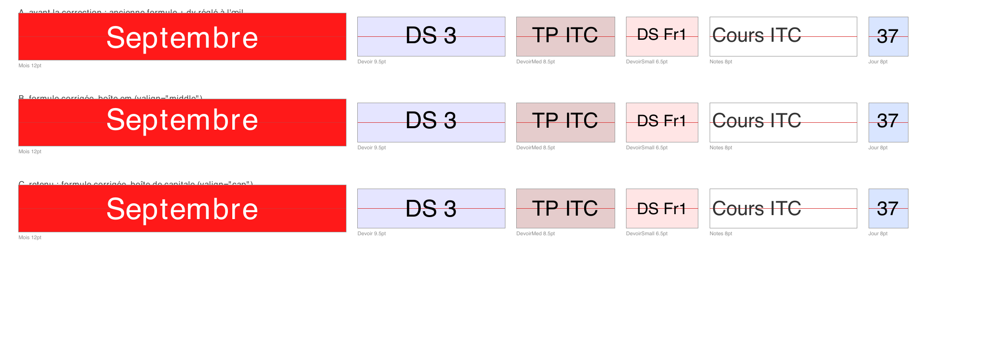

# Référence

## Sommaire

- [Les deux repères](#les-deux-repères)
- [Créer un document](#créer-un-document)
- [Le curseur](#le-curseur)
- [Les trois modes de placement](#les-trois-modes-de-placement)
- [Poser des flowables](#poser-des-flowables)
- [Tracer du texte](#tracer-du-texte)
- [Métriques de police](#métriques-de-police)
- [Formes](#formes)
- [Images](#images)
- [Styles](#styles)
- [En-tête et pied de page](#en-tête-et-pied-de-page)
- [Pagination](#pagination)
- [Frames](#frames)
- [Numérotation « page x sur y »](#numérotation--page-x-sur-y-)
- [Mise au point](#mise-au-point)
- [Migration depuis `pdf_maker`](#migration-depuis-pdf_maker)

## Les deux repères

Deux systèmes de coordonnées coexistent, et les confondre est la première source
de bugs de mise en page.

| | Origine | Sens | Unité | Où |
| --- | --- | --- | --- | --- |
| **canvas** | bas-gauche | `y` monte | points | `draw_string`, `draw_rect`, `absolute=True`, toute `Box` |
| **profondeur** | haut de page | `depth` descend | points | `doc.cursor.depth` |
| **coordonnées d'appel** | marge gauche / haut | `y` descend | `unit` (mm) | `x=` et `y=` des méthodes `draw_*` sans `absolute` |

`PageGeometry` est le seul endroit qui convertit :

```python
doc.geometry.depth_to_y(depth)   # profondeur -> ordonnée canvas
doc.geometry.y_to_depth(y)       # ordonnée canvas -> profondeur
```

Un point PostScript vaut 1/72 de pouce. `reportlab.lib.units` fournit `mm`,
`cm`, `inch`, `pica`.

## Créer un document

```python
from reportlab_layout import PDFMaker

doc = PDFMaker(
    "sortie.pdf",
    pagesize="A4",          # nom reportlab ou couple (largeur, hauteur) en points
    landscape=False,
    unit=mm,                # unité des x= et y= passés aux méthodes draw_*
    left=15, right=15, top=15, bottom=15,   # marges, exprimées en unit
    font_size=12,           # corps de référence pour add_space()
    stylesheet=None,        # None -> feuille partagée STYLES
    auto_page_break=False,
    show_boundaries=False,
)
```

Le document est aussi un gestionnaire de contexte : la sortie n'est écrite que
si le bloc se termine sans exception.

```python
with PDFMaker("sortie.pdf") as doc:
    doc.draw_paragraph("Bonjour")
```

Sinon, appeler `doc.save()` explicitement. `save()` dessine l'en-tête et le pied
de la dernière page avant d'écrire.

### Attributs de géométrie

Posés à la construction, en points, dans le repère canvas :

`width` `height` `left` `right` `top` `bottom` `content_width` `content_height`
`x_left` `x_right` `y_top` `y_bottom` `bottom_depth`

Ce sont des instantanés modifiables, pas des propriétés : une sous-classe peut
les ajuster en cours de route. La géométrie de référence reste dans
`doc.geometry`.

## Le curseur

```python
doc.cursor.depth         # profondeur courante, en points ; modifiable
doc.cursor_y             # la même position en ordonnée canvas
doc.cursor_point         # (x_left, cursor_y)
doc.remaining_height     # hauteur restante avant la marge basse
doc.cursor.fits(h)       # un élément de hauteur h tient-il encore ?

doc.advance(30)          # descendre de 30 points
doc.add_space()          # descendre d'un corps de référence
doc.add_space(2)         # de deux corps
doc.reset_cursor()       # revenir en haut de la zone de contenu
```

## Les trois modes de placement

Toutes les méthodes `draw_*` qui posent un flowable acceptent les mêmes
mots-clés, et se comportent selon ce qu'on leur donne.

**Flux** — ni `x` ni `y`. L'élément se pose sous le précédent, le curseur descend
de sa hauteur augmentée des espacements du flowable.

```python
doc.draw_paragraph("Se pose à la position courante.")
```

**Relatif** — `x` et/ou `y` donnés, en `unit`. `y` est une profondeur depuis le
haut de la page. Le curseur **ne bouge pas**.

```python
doc.draw_paragraph("À 40 mm du haut.", x=20, y=40)
```

**Absolu** — `absolute=True`. `x` et `y` sont des coordonnées canvas en
**points**. Le curseur ne bouge pas. `valign` dit ce que désigne `y` :

```python
doc.draw_paragraph("Bas du bloc sur y.",    x=100, y=200, width=200, absolute=True)
doc.draw_paragraph("Milieu du bloc sur y.", x=100, y=200, width=200, absolute=True, valign="middle")
doc.draw_paragraph("Sommet du bloc sur y.", x=100, y=200, width=200, absolute=True, valign="top")
```

## Poser des flowables

```python
doc.draw(flowable, **kwargs)                      # n'importe quel flowable reportlab
doc.draw_paragraph(texte, style=None, **kwargs)
doc.draw_table(data, col_widths=None, row_heights=None, style=None, **kwargs)
doc.draw_image(spec, width=None, height=None, scale=None, **kwargs)
doc.draw_centered_line(y=None, wscale=1.0, stroke=None, line_width=0.5)
```

Mots-clés communs de `draw` :

| Mot-clé | Effet |
| --- | --- |
| `x`, `y` | position, en `unit` (ou en points si `absolute`) |
| `width`, `height` | encombrement proposé au flowable pour son retour à la ligne |
| `before` | espace ajouté avant, en `unit` |
| `absolute` | coordonnées canvas brutes |
| `halign` | `"left"`, `"center"`, `"right"` — combiné à `wscale` |
| `valign` | `"bottom"`, `"middle"`, `"top"` — **en mode absolu seulement** |
| `wscale` | fraction de la largeur de contenu occupée par le bloc |
| `page_break` | `None` suit `auto_page_break` ; `True`/`False` forcent |
| `show_boundary` | trace la boîte de l'élément |

Chaque appel rend une `Box` :

```python
box = doc.draw_paragraph("Bonjour")
x, y, width, height = box            # se déballe comme un quadruplet
box.right, box.top, box.center       # coin bas-gauche + commodités
```

`wscale` et `halign` vont ensemble : `wscale=0.5, halign="right"` pose un bloc
de demi-largeur contre la marge droite.

### Fabriques

Pour construire un flowable sans le poser — utile pour un en-tête, un pied, ou
une cellule de tableau :

```python
doc.make_paragraph(texte, style=None)
doc.make_spacer(space=1)                 # en corps de référence
doc.make_table(data, col_widths=None, row_heights=None)
doc.make_image(spec, width=None, height=None, scale=None)
```

### Tableaux

`col_widths` non fourni répartit la largeur de contenu à parts égales ; un
scalaire s'applique à toutes les colonnes ; une liste les fixe une à une.

`style` accepte une suite de commandes reportlab, ou un `TableStyle` déjà
construit :

```python
doc.draw_table(
    [["Nom", "Note"], ["HOPPER", "17"]],
    col_widths=[40 * mm, doc.content_width - 40 * mm],
    style=[
        ("VALIGN", (0, 0), (-1, -1), "MIDDLE"),
        ("GRID", (0, 0), (-1, -1), 0.4, "#999999"),
        ("BACKGROUND", (0, 0), (-1, 0), "#f2f2f2"),
    ],
)
```

Pour du texte qui doit se replier dans une cellule, mettre un `Paragraph` plutôt
qu'une chaîne :

```python
cellules = [[doc.make_paragraph(c, "Small") for c in ligne] for ligne in data]
```

## Tracer du texte

Une seule méthode, en coordonnées canvas et en points.

```python
doc.draw_string(
    texte, x, y,
    style=None,        # nom de style, ParagraphStyle, ou None pour Normal
    scale=1.0,         # multiplie le corps du style
    color=None,        # triplet, "#rrggbb", nom CSS, ou Color reportlab
    halign="left",     # left | center | right
    valign="baseline", # baseline | middle | cap | top | bottom
    angle=0,           # rotation autour du point d'ancrage, sens trigonométrique
    dx=0, dy=0,        # décalage après ancrage, pour les retouches optiques
)
```

Ancrages verticaux, `y` désignant :

| `valign` | ce que `y` désigne |
| --- | --- |
| `baseline` | la ligne de base — le comportement de `canvas.drawString` |
| `middle` | le milieu de la boîte em, place des jambages comprise |
| `cap` | le milieu de la boîte de capitale — **le centrage des étiquettes** |
| `top` | le sommet de la boîte em |
| `bottom` | le bas de la boîte em |

### `middle` ou `cap` ?

Les deux sont exacts, ils ne centrent simplement pas la même chose.

`middle` centre la **boîte em**, qui réserve la place des jambages même quand la
chaîne n'en a pas. Sur un libellé comme `DS 3`, l'encre se retrouve alors haute
d'environ 10 % du corps.

`cap` centre la **boîte de capitale**, du pied à la hauteur des majuscules. Sur
des étiquettes courtes, l'encre tombe au milieu de la case à moins d'un
vingtième de point ; et comme le repère ne dépend pas des glyphes présents, une
rangée d'étiquettes partage la même ligne de base, qu'elles aient ou non des
jambages. C'est ce qu'il faut pour une cellule de tableau, un bandeau, un badge.

Mesures sur les cellules d'un calendrier réel, écart entre le milieu de l'encre
et le milieu de la case :

| Étiquette | corps | `middle` | `cap` |
| --- | --- | --- | --- |
| `DS 3` | 9,5 pt | +0,98 pt | +0,00 pt |
| `TP ITC` | 8,5 pt | +0,90 pt | +0,02 pt |
| `DS Fr1` | 6,5 pt | +0,66 pt | +0,00 pt |
| `Cours ITC` | 8 pt | +0,83 pt | +0,01 pt |
| `Septembre` | 12 pt | +0,10 pt | −1,14 pt |



Le filet rouge marque le milieu exact de la case. En haut l'ancienne formule
avec sa retouche réglée à l'œil, au milieu `middle`, en bas `cap`.

`Septembre` illustre la limite : son `p` descend et tire la boîte d'encre vers
le bas. C'est voulu — sur une rangée de bandeaux mensuels, on veut que `Mars` et
`Septembre` partagent une ligne de base, pas que chacun centre sa propre encre.

Un `dy` constant sur un `draw_string` est presque toujours le symptôme d'un
mauvais ancrage : il ne suit ni le corps, ni l'échelle.

Ces chiffres se remesurent avec
[`scripts/cap_height_probe.py`](../scripts/cap_height_probe.py).

`draw_string` ne replie pas le texte. Pour du texte qui doit se mettre en forme,
passer par `draw_paragraph`.

La rotation est propre : le canvas est sauvegardé, translaté au point
d'ancrage, pivoté, puis restauré. `angle=90` donne un texte lisible de bas en
haut.

```python
doc.draw_string("Semaine 12", x, y, angle=90, halign="center", valign="middle")
```

Pour dessiner soi-même avec le canvas, `apply_style` arme la police et la
couleur et rend les métriques :

```python
metrics = doc.apply_style("Heading2", scale=0.8, color="#333333")
doc.canvas.drawString(x, y, "tracé à la main")
```

## Métriques de police

```python
from reportlab_layout import TextMetrics, string_width, font_height, baseline_offset

m = TextMetrics(style, scale=0.5)
m.font_name, m.font_size, m.leading
m.ascent      # > 0
m.descent     # < 0
m.height      # ascent - descent, hauteur de la boîte em
m.cap_height  # hauteur des majuscules au-dessus de la ligne de base
m.baseline_offset            # (ascent + descent) / 2, décalage de centrage em
m.cap_offset                 # cap_height / 2, décalage de centrage capitale
m.width("Bonjour")
m.baseline(y, "middle")      # ligne de base pour un ancrage donné
m.left_edge(x, "Bonjour", "center")
```

Toutes les métriques tiennent compte de `scale`. C'est le point : mesurer au
corps nominal puis dessiner à `scale=0.5` produit un centrage faux d'un facteur
deux, horizontalement comme verticalement.

`cap_height` mérite un mot : reportlab ne l'expose pas pour les quatorze polices
PostScript standard, il ne donne que l'ascendante — qui vaut la hauteur de
capitale chez Helvetica, mais la dépasse de 3 % chez Times et de 12 % chez
Courier. Le paquet embarque donc la table publiée dans les fichiers AFM d'Adobe
(`STANDARD_CAP_HEIGHTS`), lit `face.capHeight` quand la fonte la déclare
(TrueType), et se rabat sur l'ascendante en dernier recours.

`doc.metrics(style, scale)` rend le même objet en résolvant le style dans la
feuille du document.

## Formes

Coordonnées canvas, en points. Chaque tracé rend une `Box` et ne laisse aucun
état sur le canvas.

```python
doc.draw_line(x1, y1, x2, y2, stroke="black", line_width=0.5)
doc.draw_rect(x, y, w, h, fill=None, stroke="black", line_width=0.5)
doc.draw_round_rect(x, y, w, h, radius=5, fill=None, stroke="black", line_width=0.5)
```

`fill=None` laisse l'intérieur vide ; `stroke=None` supprime le contour. Les
couleurs acceptent un triplet ou quadruplet `0..1`, une chaîne `"#rrggbb"`, un
nom CSS, ou un `Color` reportlab. `radius` est écrêté à la moitié du plus petit
côté.

## Images

```python
from reportlab_layout import image_spec, load_image

spec = image_spec("logo.png")        # lit les dimensions en pixels une fois
spec.width, spec.height, spec.aspect
spec.scaled(width=50 * mm)           # -> (largeur, hauteur) en points

doc.draw_image(spec, width=30 * mm)  # rapport d'aspect conservé
doc.draw_image("logo.png", height=20 * mm)
doc.draw_image(spec, scale=0.5)
```

Donner `width` **et** `height` force le rapport, ce qui est parfois voulu.
Ne rien donner lève une `ValueError` plutôt que de deviner.

## Styles

```python
from reportlab_layout import make_stylesheet, add_style, STYLES
```

`make_stylesheet()` rend une feuille **neuve** à chaque appel : celle de
reportlab, augmentée de `Left`, `Right`, `Centered`, `Justify`, `Small`,
`Footer`, `Heading1 Centered`, `Heading1 Left`.

`STYLES` est une feuille partagée par le module. Pratique dans un script,
dangereux dans une bibliothèque : deux modules qui y ajoutent le même nom se
marchent dessus. Dès qu'un document a des styles à lui :

```python
styles = make_stylesheet()
add_style(styles, "Titre", parent="Heading1", fontSize=24, leading=28)
add_style(styles, "Mention", parent="Small", textColor="#555555")

doc = PDFMaker("sortie.pdf", stylesheet=styles)
doc.draw_paragraph("Titre du document", "Titre")
```

`add_style` remplace un style déjà défini au lieu de lever `KeyError` — un
module réimporté ne casse plus. `replace=False` restaure le comportement de
reportlab.

Partout où un style est attendu, on peut donner son nom, un `ParagraphStyle`, ou
`None` pour `Normal`.

## En-tête et pied de page

Redessinés sur chaque page, sans toucher au curseur.

```python
doc.set_footer(doc.make_paragraph("Version du 25/08/2026", "Right"))
doc.set_header([logo, doc.make_paragraph("Établissement X", "Centered")])
```

Le pied se place sur la limite basse de la zone de contenu, l'en-tête sur la
limite haute. Ils sont dessinés par `new_page()` et par `save()`.

Les attributs `doc.header` et `doc.footer` sont des listes ; on peut les
affecter directement.

## Pagination

```python
doc.new_page()      # dessine en-tête et pied, tourne la page, remet le curseur en haut
doc.page            # numéro de la page courante
```

Avec `auto_page_break=True`, un élément qui déborderait sous la marge basse
déclenche une nouvelle page avant d'être posé.

```python
doc = PDFMaker("sortie.pdf", auto_page_break=True)
```

`page_break=False` sur un appel désactive le saut pour cet élément ;
`page_break=True` l'active même si le document ne l'a pas demandé.

Le saut n'a lieu qu'en mode flux : un élément placé à une position explicite est
posé où on l'a dit.

## Frames

Un frame est une boîte de hauteur fixe que reportlab remplit tout seul, en
gérant le retour à la ligne, et qui s'arrête quand c'est plein.

```python
doc.new_frame(height=60, wscale=0.5, show_boundary=True)
reste = doc.frame_paragraph("Un texte qui se replie dans la boîte.")
doc.frame_image("logo.png", width=30 * mm)
doc.frame_space(1)
```

Ce qui n'a pas tenu est **rendu** par l'appel et signalé dans les journaux, au
lieu de disparaître en silence. `new_frame` fait descendre le curseur de la
hauteur du frame.

`doc.draw_frame(story, space=0)` écrit une liste de flowables d'un coup.

## Numérotation « page x sur y »

Le nombre total de pages n'étant connu qu'à la fin, il faut un canvas qui
mémorise les pages et les rejoue.

```python
from reportlab.platypus import SimpleDocTemplate
from reportlab_layout import NumberedCanvas

SimpleDocTemplate("sortie.pdf").build(story, canvasmaker=NumberedCanvas)
```

Il fonctionne aussi comme canvas autonome, sans `DocTemplate` — c'est la
différence avec la recette qui circule, laquelle perd silencieusement la
dernière page dans ce cas.

Pour changer la présentation :

```python
class Folio(NumberedCanvas):
    folio_position = (200 * mm, 8 * mm)
    folio_font = ("Helvetica-Oblique", 8)
    folio_label = staticmethod(lambda page, total: f"— {page} / {total} —")
```

Ou surcharger `draw_folio(page, total)` pour un rendu complet.

## Mise au point

`show_boundaries=True` à la construction, ou `show_boundary=True` sur un appel,
trace la boîte de chaque élément posé.

Le paquet journalise par `logging`, sans jamais imprimer :

```python
import logging
logging.basicConfig(level=logging.DEBUG)
```

`reportlab_layout.document` émet les changements de page et les créations de
frame en `DEBUG` ; `reportlab_layout.frames` signale les débordements en
`WARNING`.

## Migration depuis `pdf_maker`

L'API est passée en `snake_case` et plusieurs signatures ont changé.

| Avant | Après |
| --- | --- |
| `from pdf_maker import …` | `from reportlab_layout import …` |
| `PDFMaker(f, fontsize=, verbose=, showboundaries=, autobreak=)` | `PDFMaker(f, font_size=, show_boundaries=, auto_page_break=)` (plus de `verbose` : `logging`) |
| `self.c` | `self.canvas` |
| `self.cursor` (flottant) | `self.cursor.depth` |
| `self.coord()` | `self.cursor_point`, `self.cursor_y` |
| `activewidth`, `activeheight` | `content_width`, `content_height` |
| `activebottom`, `bottomheight` | `bottom_depth`, `remaining_height` |
| `self.foot`, `self.head` | `self.footer`, `self.header` |
| `self.space` | `self.default_space` |
| `self.today` | supprimé — la mise en forme de date relève de l'appelant |
| `savePDF()` | `save()` |
| `newPage()`, `addSpace()`, `addcursor(h)` | `new_page()`, `add_space()`, `advance(h)` |
| `setMeta()` | `set_metadata()` |
| `getParagraph/getTable/getSpace` | `make_paragraph/make_table/make_spacer` |
| `drawParagraph/drawTable/drawImage` | `draw_paragraph/draw_table/draw_image` |
| `drawCenteredLine`, `drawRect`, `drawRectRounded` | `draw_centered_line`, `draw_rect`, `draw_round_rect` |
| `set_style(n, size=, rgb=)` | `apply_style(n, scale=, color=)` |
| `drawStringCenterH(x, y, s, …)` | `draw_string(s, x, y, halign="center")` |
| `drawStringCenterHV(x, y, s, …)` | `draw_string(s, x, y, halign="center", valign="middle")` |
| `drawStringCenterHVVertical(x, y, s, …)` | `draw_string(s, x, y, halign="center", valign="middle", angle=90)` |
| `drawStringLeftCenterV(x, y, s, …)` | `draw_string(s, x, y, valign="middle")` |
| `topage=True` | `absolute=True` |
| `w=`, `h=`, `colwidth=` | `width=`, `height=`, `col_widths=` |
| `fillRGB=`, `strokeRGB=`, `lw=`, `round=` | `fill=`, `stroke=`, `line_width=`, `radius=` |
| `imspecs()`, `get_image(…, largeur=)` | `image_spec()`, `load_image(…, width=)` |
| `drawParagraph` rendait `(p, (x, y, w, h))` | toutes les méthodes rendent une `Box` |
| `styles` global partagé | `make_stylesheet()`, passé par `stylesheet=` |

Attention aux deux changements qui ne se voient pas à la relecture :

- **Le texte centré verticalement remonte** d'environ 20 % du corps. C'est la
  correction ; les positions ajustées à la main pour compenser l'ancien décalage
  sont à revoir.
- **`before=` est désormais en `unit`** partout. Il était en `unit` pour le
  positionnement et en points pour l'avance du curseur, ce qui déplaçait les
  éléments suivants.
